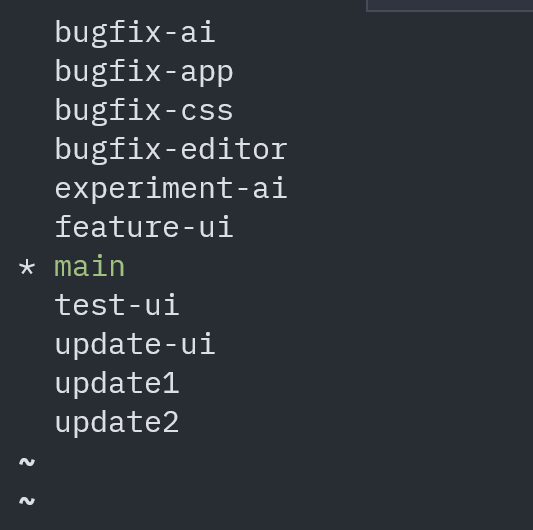
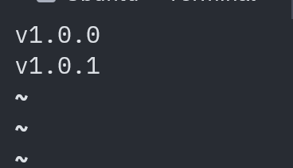
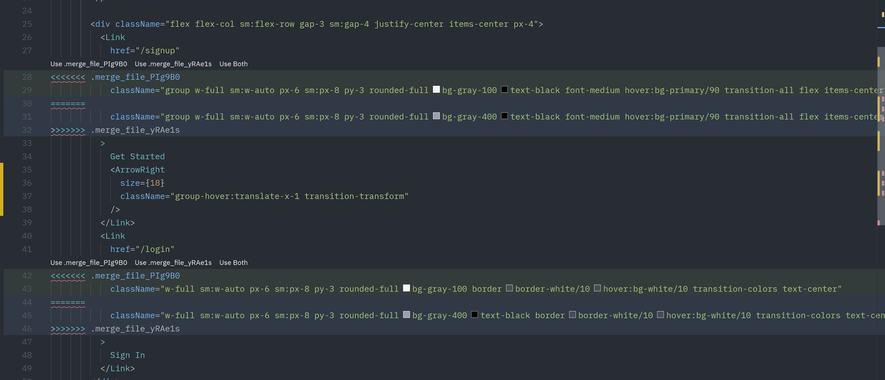
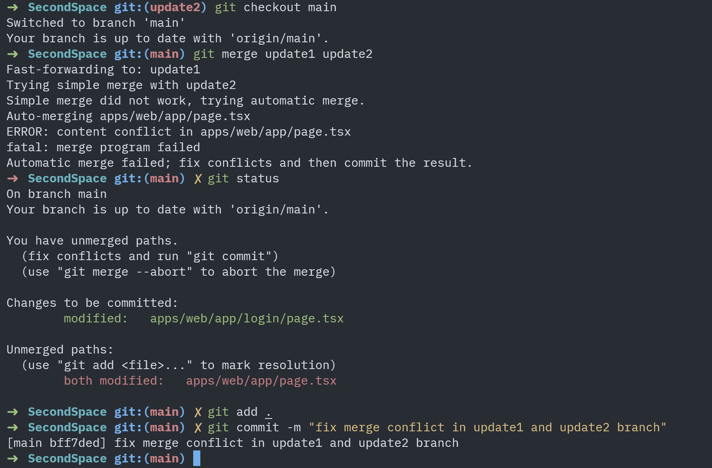
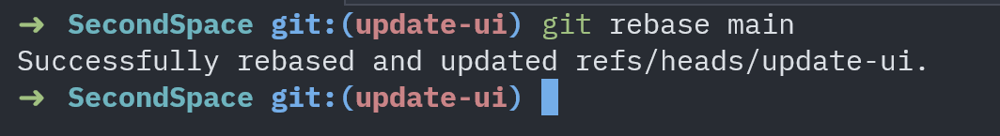
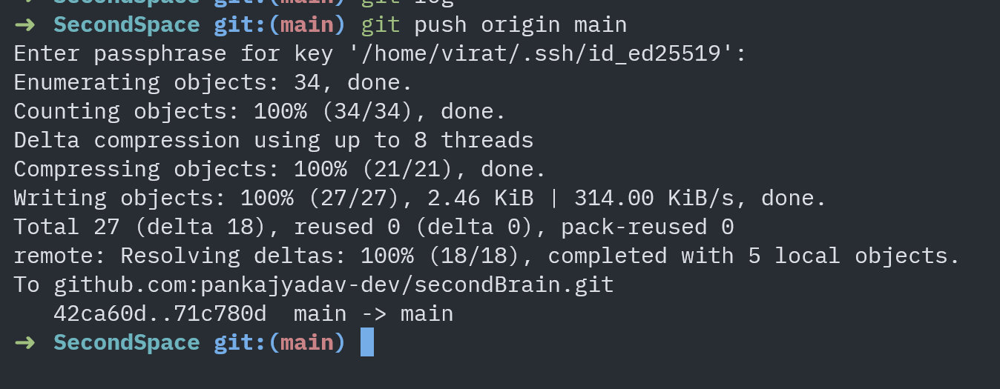
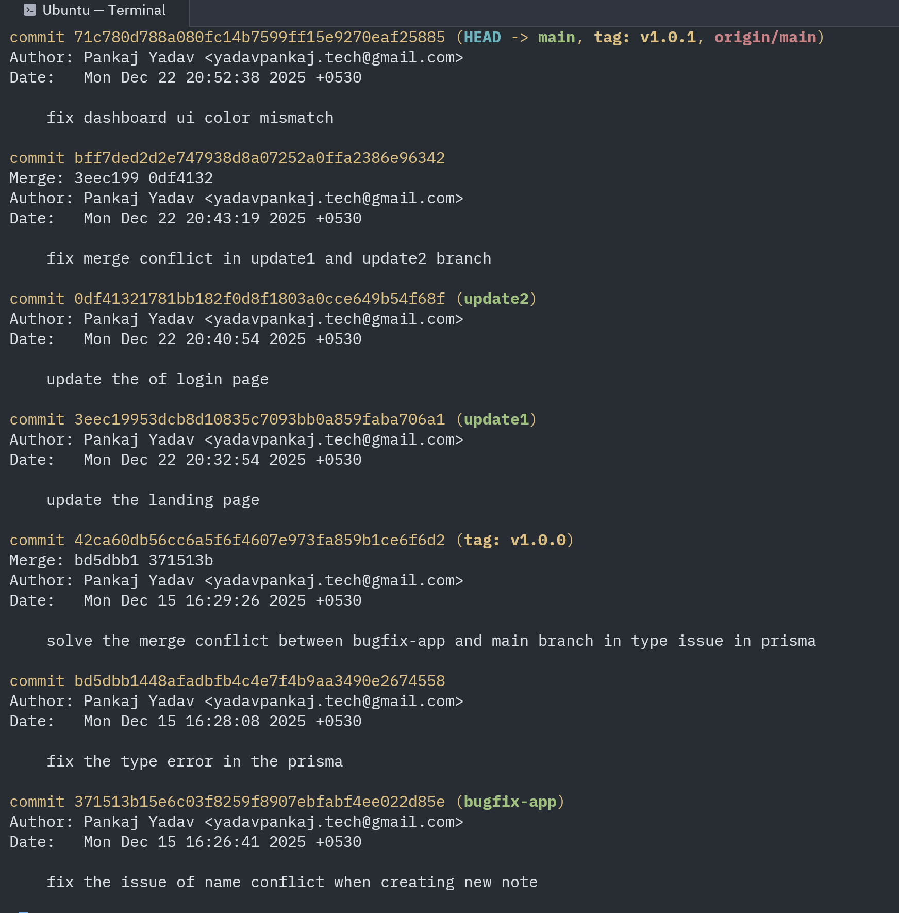
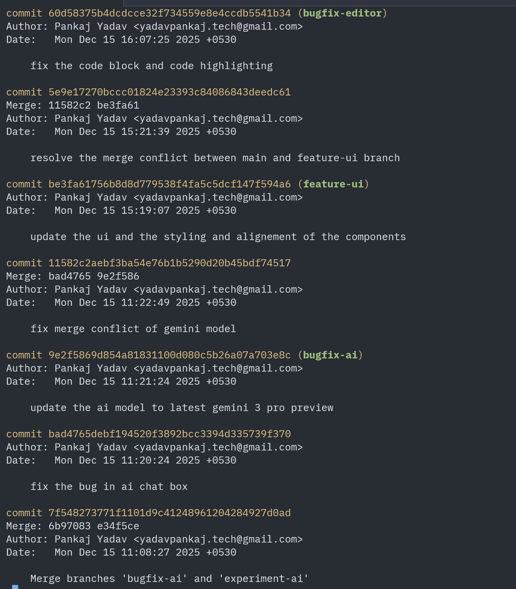
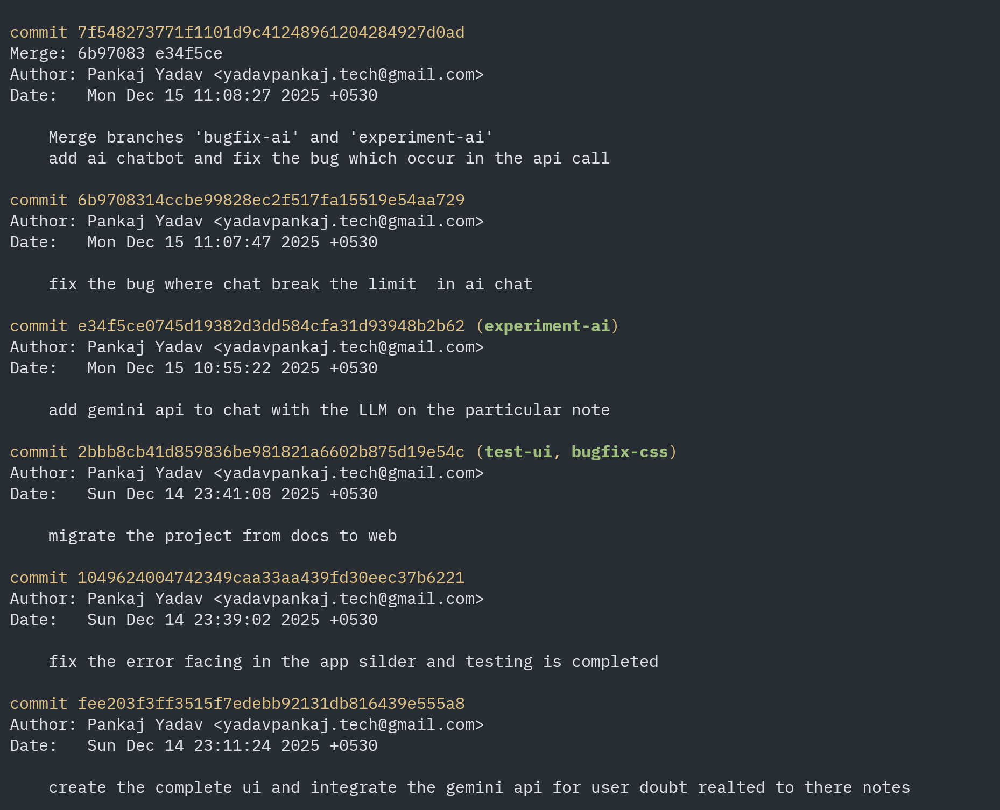
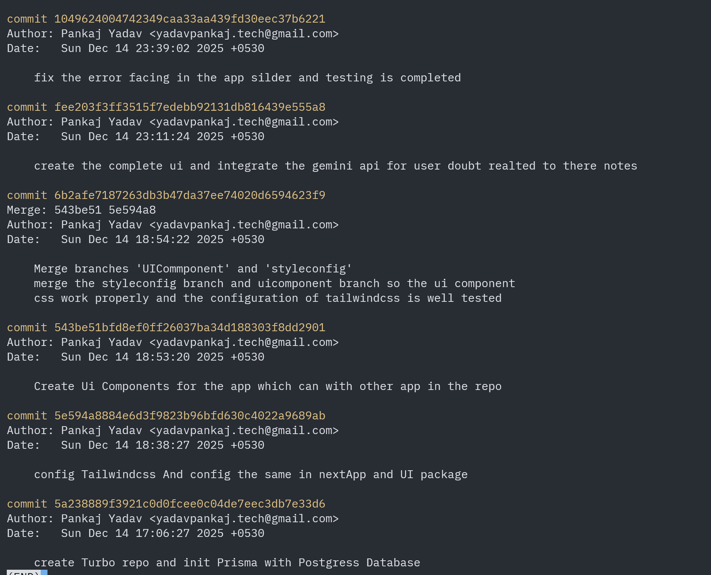

<div id="top">

<!-- HEADER STYLE: CLASSIC -->
<div align="center">

# SECONDBRAIN.GIT
</div>
<br>

---

## Table of Contents

- [Table of Contents](#table-of-contents)
- [Overview](#overview)
- [Features](#features)
- [Project Structure](#project-structure)
    - [Project Index](#project-index)
- [Getting Started](#getting-started)
    - [Prerequisites](#prerequisites)
    - [Installation](#installation)
    - [Usage](#usage)
    - [Testing](#testing)
- [Roadmap](#roadmap)
- [Contributing](#contributing)
- [License](#license)
- [Acknowledgments](#acknowledgments)

---

## Overview


## Project Structure

```sh
└── secondBrain.git/
    ├── README.md
    ├── apps
    │   └── web
    ├── bun.lock
    ├── package.json
    ├── packages
    │   ├── database
    │   ├── eslint-config
    │   ├── tailwind-config
    │   ├── typescript-config
    │   └── ui
    └── turbo.json
```

### Project Index

<details open>
	<summary><b><code>SECONDBRAIN.GIT/</code></b></summary>
	<!-- __root__ Submodule -->
	<details>
		<summary><b>__root__</b></summary>
		<blockquote>
			<div class='directory-path' style='padding: 8px 0; color: #666;'>
				<code><b>⦿ __root__</b></code>
			<table style='width: 100%; border-collapse: collapse;'>
			<thead>
				<tr style='background-color: #f8f9fa;'>
					<th style='width: 30%; text-align: left; padding: 8px;'>File Name</th>
					<th style='text-align: left; padding: 8px;'>Summary</th>
				</tr>
			</thead>
				<tr style='border-bottom: 1px solid #eee;'>
					<td style='padding: 8px;'><b><a href='https://github.com/pankajyadav-dev/secondBrain.git/blob/master/package.json'>package.json</a></b></td>
					<td style='padding: 8px;'>Code>❯ REPLACE-ME</code></td>
				</tr>
				<tr style='border-bottom: 1px solid #eee;'>
					<td style='padding: 8px;'><b><a href='https://github.com/pankajyadav-dev/secondBrain.git/blob/master/turbo.json'>turbo.json</a></b></td>
					<td style='padding: 8px;'>Code>❯ REPLACE-ME</code></td>
				</tr>
			</table>
		</blockquote>
	</details>
	<!-- apps Submodule -->
	<details>
		<summary><b>apps</b></summary>
		<blockquote>
			<div class='directory-path' style='padding: 8px 0; color: #666;'>
				<code><b>⦿ apps</b></code>
			<!-- web Submodule -->
			<details>
				<summary><b>web</b></summary>
				<blockquote>
					<div class='directory-path' style='padding: 8px 0; color: #666;'>
						<code><b>⦿ apps.web</b></code>
					<table style='width: 100%; border-collapse: collapse;'>
					<thead>
						<tr style='background-color: #f8f9fa;'>
							<th style='width: 30%; text-align: left; padding: 8px;'>File Name</th>
							<th style='text-align: left; padding: 8px;'>Summary</th>
						</tr>
					</thead>
						<tr style='border-bottom: 1px solid #eee;'>
							<td style='padding: 8px;'><b><a href='https://github.com/pankajyadav-dev/secondBrain.git/blob/master/apps/web/eslint.config.js'>eslint.config.js</a></b></td>
							<td style='padding: 8px;'>Code>❯ REPLACE-ME</code></td>
						</tr>
						<tr style='border-bottom: 1px solid #eee;'>
							<td style='padding: 8px;'><b><a href='https://github.com/pankajyadav-dev/secondBrain.git/blob/master/apps/web/tsconfig.json'>tsconfig.json</a></b></td>
							<td style='padding: 8px;'>Code>❯ REPLACE-ME</code></td>
						</tr>
						<tr style='border-bottom: 1px solid #eee;'>
							<td style='padding: 8px;'><b><a href='https://github.com/pankajyadav-dev/secondBrain.git/blob/master/apps/web/package.json'>package.json</a></b></td>
							<td style='padding: 8px;'>Code>❯ REPLACE-ME</code></td>
						</tr>
						<tr style='border-bottom: 1px solid #eee;'>
							<td style='padding: 8px;'><b><a href='https://github.com/pankajyadav-dev/secondBrain.git/blob/master/apps/web/next.config.js'>next.config.js</a></b></td>
							<td style='padding: 8px;'>Code>❯ REPLACE-ME</code></td>
						</tr>
						<tr style='border-bottom: 1px solid #eee;'>
							<td style='padding: 8px;'><b><a href='https://github.com/pankajyadav-dev/secondBrain.git/blob/master/apps/web/postcss.config.js'>postcss.config.js</a></b></td>
							<td style='padding: 8px;'>Code>❯ REPLACE-ME</code></td>
						</tr>
					</table>
					<!-- components Submodule -->
					<details>
						<summary><b>components</b></summary>
						<blockquote>
							<div class='directory-path' style='padding: 8px 0; color: #666;'>
								<code><b>⦿ apps.web.components</b></code>
							<table style='width: 100%; border-collapse: collapse;'>
							<thead>
								<tr style='background-color: #f8f9fa;'>
									<th style='width: 30%; text-align: left; padding: 8px;'>File Name</th>
									<th style='text-align: left; padding: 8px;'>Summary</th>
								</tr>
							</thead>
								<tr style='border-bottom: 1px solid #eee;'>
									<td style='padding: 8px;'><b><a href='https://github.com/pankajyadav-dev/secondBrain.git/blob/master/apps/web/components/AIChatSidebar.tsx'>AIChatSidebar.tsx</a></b></td>
									<td style='padding: 8px;'>Code>❯ REPLACE-ME</code></td>
								</tr>
								<tr style='border-bottom: 1px solid #eee;'>
									<td style='padding: 8px;'><b><a href='https://github.com/pankajyadav-dev/secondBrain.git/blob/master/apps/web/components/AppSidebar.tsx'>AppSidebar.tsx</a></b></td>
									<td style='padding: 8px;'>Code>❯ REPLACE-ME</code></td>
								</tr>
								<tr style='border-bottom: 1px solid #eee;'>
									<td style='padding: 8px;'><b><a href='https://github.com/pankajyadav-dev/secondBrain.git/blob/master/apps/web/components/TipTapEditor.tsx'>TipTapEditor.tsx</a></b></td>
									<td style='padding: 8px;'>Code>❯ REPLACE-ME</code></td>
								</tr>
								<tr style='border-bottom: 1px solid #eee;'>
									<td style='padding: 8px;'><b><a href='https://github.com/pankajyadav-dev/secondBrain.git/blob/master/apps/web/components/EditorClientWrapper.tsx'>EditorClientWrapper.tsx</a></b></td>
									<td style='padding: 8px;'>Code>❯ REPLACE-ME</code></td>
								</tr>
							</table>
						</blockquote>
					</details>
					<!-- lib Submodule -->
					<details>
						<summary><b>lib</b></summary>
						<blockquote>
							<div class='directory-path' style='padding: 8px 0; color: #666;'>
								<code><b>⦿ apps.web.lib</b></code>
							<table style='width: 100%; border-collapse: collapse;'>
							<thead>
								<tr style='background-color: #f8f9fa;'>
									<th style='width: 30%; text-align: left; padding: 8px;'>File Name</th>
									<th style='text-align: left; padding: 8px;'>Summary</th>
								</tr>
							</thead>
								<tr style='border-bottom: 1px solid #eee;'>
									<td style='padding: 8px;'><b><a href='https://github.com/pankajyadav-dev/secondBrain.git/blob/master/apps/web/lib/auth.ts'>auth.ts</a></b></td>
									<td style='padding: 8px;'>Code>❯ REPLACE-ME</code></td>
								</tr>
							</table>
						</blockquote>
					</details>
					<!-- hooks Submodule -->
					<details>
						<summary><b>hooks</b></summary>
						<blockquote>
							<div class='directory-path' style='padding: 8px 0; color: #666;'>
								<code><b>⦿ apps.web.hooks</b></code>
							<table style='width: 100%; border-collapse: collapse;'>
							<thead>
								<tr style='background-color: #f8f9fa;'>
									<th style='width: 30%; text-align: left; padding: 8px;'>File Name</th>
									<th style='text-align: left; padding: 8px;'>Summary</th>
								</tr>
							</thead>
								<tr style='border-bottom: 1px solid #eee;'>
									<td style='padding: 8px;'><b><a href='https://github.com/pankajyadav-dev/secondBrain.git/blob/master/apps/web/hooks/useDebounce.ts'>useDebounce.ts</a></b></td>
									<td style='padding: 8px;'>Code>❯ REPLACE-ME</code></td>
								</tr>
							</table>
						</blockquote>
					</details>
					<!-- app Submodule -->
					<details>
						<summary><b>app</b></summary>
						<blockquote>
							<div class='directory-path' style='padding: 8px 0; color: #666;'>
								<code><b>⦿ apps.web.app</b></code>
							<table style='width: 100%; border-collapse: collapse;'>
							<thead>
								<tr style='background-color: #f8f9fa;'>
									<th style='width: 30%; text-align: left; padding: 8px;'>File Name</th>
									<th style='text-align: left; padding: 8px;'>Summary</th>
								</tr>
							</thead>
								<tr style='border-bottom: 1px solid #eee;'>
									<td style='padding: 8px;'><b><a href='https://github.com/pankajyadav-dev/secondBrain.git/blob/master/apps/web/app/globals.css'>globals.css</a></b></td>
									<td style='padding: 8px;'>Code>❯ REPLACE-ME</code></td>
								</tr>
								<tr style='border-bottom: 1px solid #eee;'>
									<td style='padding: 8px;'><b><a href='https://github.com/pankajyadav-dev/secondBrain.git/blob/master/apps/web/app/providers.tsx'>providers.tsx</a></b></td>
									<td style='padding: 8px;'>Code>❯ REPLACE-ME</code></td>
								</tr>
								<tr style='border-bottom: 1px solid #eee;'>
									<td style='padding: 8px;'><b><a href='https://github.com/pankajyadav-dev/secondBrain.git/blob/master/apps/web/app/layout.tsx'>layout.tsx</a></b></td>
									<td style='padding: 8px;'>Code>❯ REPLACE-ME</code></td>
								</tr>
								<tr style='border-bottom: 1px solid #eee;'>
									<td style='padding: 8px;'><b><a href='https://github.com/pankajyadav-dev/secondBrain.git/blob/master/apps/web/app/page.tsx'>page.tsx</a></b></td>
									<td style='padding: 8px;'>Code>❯ REPLACE-ME</code></td>
								</tr>
							</table>
							<!-- editor Submodule -->
							<details>
								<summary><b>editor</b></summary>
								<blockquote>
									<div class='directory-path' style='padding: 8px 0; color: #666;'>
										<code><b>⦿ apps.web.app.editor</b></code>
									<!-- [id] Submodule -->
									<details>
										<summary><b>[id]</b></summary>
										<blockquote>
											<div class='directory-path' style='padding: 8px 0; color: #666;'>
												<code><b>⦿ apps.web.app.editor.[id]</b></code>
											<table style='width: 100%; border-collapse: collapse;'>
											<thead>
												<tr style='background-color: #f8f9fa;'>
													<th style='width: 30%; text-align: left; padding: 8px;'>File Name</th>
													<th style='text-align: left; padding: 8px;'>Summary</th>
												</tr>
											</thead>
												<tr style='border-bottom: 1px solid #eee;'>
													<td style='padding: 8px;'><b><a href='https://github.com/pankajyadav-dev/secondBrain.git/blob/master/apps/web/app/editor/[id]/page.tsx'>page.tsx</a></b></td>
													<td style='padding: 8px;'>Code>❯ REPLACE-ME</code></td>
												</tr>
											</table>
										</blockquote>
									</details>
								</blockquote>
							</details>
							<!-- dashboard Submodule -->
							<details>
								<summary><b>dashboard</b></summary>
								<blockquote>
									<div class='directory-path' style='padding: 8px 0; color: #666;'>
										<code><b>⦿ apps.web.app.dashboard</b></code>
									<table style='width: 100%; border-collapse: collapse;'>
									<thead>
										<tr style='background-color: #f8f9fa;'>
											<th style='width: 30%; text-align: left; padding: 8px;'>File Name</th>
											<th style='text-align: left; padding: 8px;'>Summary</th>
										</tr>
									</thead>
										<tr style='border-bottom: 1px solid #eee;'>
											<td style='padding: 8px;'><b><a href='https://github.com/pankajyadav-dev/secondBrain.git/blob/master/apps/web/app/dashboard/page.tsx'>page.tsx</a></b></td>
											<td style='padding: 8px;'>Code>❯ REPLACE-ME</code></td>
										</tr>
									</table>
								</blockquote>
							</details>
							<!-- login Submodule -->
							<details>
								<summary><b>login</b></summary>
								<blockquote>
									<div class='directory-path' style='padding: 8px 0; color: #666;'>
										<code><b>⦿ apps.web.app.login</b></code>
									<table style='width: 100%; border-collapse: collapse;'>
									<thead>
										<tr style='background-color: #f8f9fa;'>
											<th style='width: 30%; text-align: left; padding: 8px;'>File Name</th>
											<th style='text-align: left; padding: 8px;'>Summary</th>
										</tr>
									</thead>
										<tr style='border-bottom: 1px solid #eee;'>
											<td style='padding: 8px;'><b><a href='https://github.com/pankajyadav-dev/secondBrain.git/blob/master/apps/web/app/login/page.tsx'>page.tsx</a></b></td>
											<td style='padding: 8px;'>Code>❯ REPLACE-ME</code></td>
										</tr>
									</table>
								</blockquote>
							</details>
							<!-- api Submodule -->
							<details>
								<summary><b>api</b></summary>
								<blockquote>
									<div class='directory-path' style='padding: 8px 0; color: #666;'>
										<code><b>⦿ apps.web.app.api</b></code>
									<!-- ai Submodule -->
									<details>
										<summary><b>ai</b></summary>
										<blockquote>
											<div class='directory-path' style='padding: 8px 0; color: #666;'>
												<code><b>⦿ apps.web.app.api.ai</b></code>
											<!-- chat Submodule -->
											<details>
												<summary><b>chat</b></summary>
												<blockquote>
													<div class='directory-path' style='padding: 8px 0; color: #666;'>
														<code><b>⦿ apps.web.app.api.ai.chat</b></code>
													<table style='width: 100%; border-collapse: collapse;'>
													<thead>
														<tr style='background-color: #f8f9fa;'>
															<th style='width: 30%; text-align: left; padding: 8px;'>File Name</th>
															<th style='text-align: left; padding: 8px;'>Summary</th>
														</tr>
													</thead>
														<tr style='border-bottom: 1px solid #eee;'>
															<td style='padding: 8px;'><b><a href='https://github.com/pankajyadav-dev/secondBrain.git/blob/master/apps/web/app/api/ai/chat/route.ts'>route.ts</a></b></td>
															<td style='padding: 8px;'>Code>❯ REPLACE-ME</code></td>
														</tr>
													</table>
												</blockquote>
											</details>
										</blockquote>
									</details>
									<!-- notes Submodule -->
									<details>
										<summary><b>notes</b></summary>
										<blockquote>
											<div class='directory-path' style='padding: 8px 0; color: #666;'>
												<code><b>⦿ apps.web.app.api.notes</b></code>
											<table style='width: 100%; border-collapse: collapse;'>
											<thead>
												<tr style='background-color: #f8f9fa;'>
													<th style='width: 30%; text-align: left; padding: 8px;'>File Name</th>
													<th style='text-align: left; padding: 8px;'>Summary</th>
												</tr>
											</thead>
												<tr style='border-bottom: 1px solid #eee;'>
													<td style='padding: 8px;'><b><a href='https://github.com/pankajyadav-dev/secondBrain.git/blob/master/apps/web/app/api/notes/route.ts'>route.ts</a></b></td>
													<td style='padding: 8px;'>Code>❯ REPLACE-ME</code></td>
												</tr>
											</table>
											<!-- [id] Submodule -->
											<details>
												<summary><b>[id]</b></summary>
												<blockquote>
													<div class='directory-path' style='padding: 8px 0; color: #666;'>
														<code><b>⦿ apps.web.app.api.notes.[id]</b></code>
													<table style='width: 100%; border-collapse: collapse;'>
													<thead>
														<tr style='background-color: #f8f9fa;'>
															<th style='width: 30%; text-align: left; padding: 8px;'>File Name</th>
															<th style='text-align: left; padding: 8px;'>Summary</th>
														</tr>
													</thead>
														<tr style='border-bottom: 1px solid #eee;'>
															<td style='padding: 8px;'><b><a href='https://github.com/pankajyadav-dev/secondBrain.git/blob/master/apps/web/app/api/notes/[id]/route.ts'>route.ts</a></b></td>
															<td style='padding: 8px;'>Code>❯ REPLACE-ME</code></td>
														</tr>
													</table>
												</blockquote>
											</details>
										</blockquote>
									</details>
									<!-- folders Submodule -->
									<details>
										<summary><b>folders</b></summary>
										<blockquote>
											<div class='directory-path' style='padding: 8px 0; color: #666;'>
												<code><b>⦿ apps.web.app.api.folders</b></code>
											<table style='width: 100%; border-collapse: collapse;'>
											<thead>
												<tr style='background-color: #f8f9fa;'>
													<th style='width: 30%; text-align: left; padding: 8px;'>File Name</th>
													<th style='text-align: left; padding: 8px;'>Summary</th>
												</tr>
											</thead>
												<tr style='border-bottom: 1px solid #eee;'>
													<td style='padding: 8px;'><b><a href='https://github.com/pankajyadav-dev/secondBrain.git/blob/master/apps/web/app/api/folders/route.ts'>route.ts</a></b></td>
													<td style='padding: 8px;'>Code>❯ REPLACE-ME</code></td>
												</tr>
											</table>
											<!-- [id] Submodule -->
											<details>
												<summary><b>[id]</b></summary>
												<blockquote>
													<div class='directory-path' style='padding: 8px 0; color: #666;'>
														<code><b>⦿ apps.web.app.api.folders.[id]</b></code>
													<table style='width: 100%; border-collapse: collapse;'>
													<thead>
														<tr style='background-color: #f8f9fa;'>
															<th style='width: 30%; text-align: left; padding: 8px;'>File Name</th>
															<th style='text-align: left; padding: 8px;'>Summary</th>
														</tr>
													</thead>
														<tr style='border-bottom: 1px solid #eee;'>
															<td style='padding: 8px;'><b><a href='https://github.com/pankajyadav-dev/secondBrain.git/blob/master/apps/web/app/api/folders/[id]/route.ts'>route.ts</a></b></td>
															<td style='padding: 8px;'>Code>❯ REPLACE-ME</code></td>
														</tr>
													</table>
												</blockquote>
											</details>
										</blockquote>
									</details>
									<!-- auth Submodule -->
									<details>
										<summary><b>auth</b></summary>
										<blockquote>
											<div class='directory-path' style='padding: 8px 0; color: #666;'>
												<code><b>⦿ apps.web.app.api.auth</b></code>
											<!-- [...nextauth] Submodule -->
											<details>
												<summary><b>[...nextauth]</b></summary>
												<blockquote>
													<div class='directory-path' style='padding: 8px 0; color: #666;'>
														<code><b>⦿ apps.web.app.api.auth.[...nextauth]</b></code>
													<table style='width: 100%; border-collapse: collapse;'>
													<thead>
														<tr style='background-color: #f8f9fa;'>
															<th style='width: 30%; text-align: left; padding: 8px;'>File Name</th>
															<th style='text-align: left; padding: 8px;'>Summary</th>
														</tr>
													</thead>
														<tr style='border-bottom: 1px solid #eee;'>
															<td style='padding: 8px;'><b><a href='https://github.com/pankajyadav-dev/secondBrain.git/blob/master/apps/web/app/api/auth/[...nextauth]/route.ts'>route.ts</a></b></td>
															<td style='padding: 8px;'>Code>❯ REPLACE-ME</code></td>
														</tr>
													</table>
												</blockquote>
											</details>
											<!-- register Submodule -->
											<details>
												<summary><b>register</b></summary>
												<blockquote>
													<div class='directory-path' style='padding: 8px 0; color: #666;'>
														<code><b>⦿ apps.web.app.api.auth.register</b></code>
													<table style='width: 100%; border-collapse: collapse;'>
													<thead>
														<tr style='background-color: #f8f9fa;'>
															<th style='width: 30%; text-align: left; padding: 8px;'>File Name</th>
															<th style='text-align: left; padding: 8px;'>Summary</th>
														</tr>
													</thead>
														<tr style='border-bottom: 1px solid #eee;'>
															<td style='padding: 8px;'><b><a href='https://github.com/pankajyadav-dev/secondBrain.git/blob/master/apps/web/app/api/auth/register/route.ts'>route.ts</a></b></td>
															<td style='padding: 8px;'>Code>❯ REPLACE-ME</code></td>
														</tr>
													</table>
												</blockquote>
											</details>
										</blockquote>
									</details>
								</blockquote>
							</details>
							<!-- signup Submodule -->
							<details>
								<summary><b>signup</b></summary>
								<blockquote>
									<div class='directory-path' style='padding: 8px 0; color: #666;'>
										<code><b>⦿ apps.web.app.signup</b></code>
									<table style='width: 100%; border-collapse: collapse;'>
									<thead>
										<tr style='background-color: #f8f9fa;'>
											<th style='width: 30%; text-align: left; padding: 8px;'>File Name</th>
											<th style='text-align: left; padding: 8px;'>Summary</th>
										</tr>
									</thead>
										<tr style='border-bottom: 1px solid #eee;'>
											<td style='padding: 8px;'><b><a href='https://github.com/pankajyadav-dev/secondBrain.git/blob/master/apps/web/app/signup/page.tsx'>page.tsx</a></b></td>
											<td style='padding: 8px;'>Code>❯ REPLACE-ME</code></td>
										</tr>
									</table>
								</blockquote>
							</details>
						</blockquote>
					</details>
					<!-- types Submodule -->
					<details>
						<summary><b>types</b></summary>
						<blockquote>
							<div class='directory-path' style='padding: 8px 0; color: #666;'>
								<code><b>⦿ apps.web.types</b></code>
							<table style='width: 100%; border-collapse: collapse;'>
							<thead>
								<tr style='background-color: #f8f9fa;'>
									<th style='width: 30%; text-align: left; padding: 8px;'>File Name</th>
									<th style='text-align: left; padding: 8px;'>Summary</th>
								</tr>
							</thead>
								<tr style='border-bottom: 1px solid #eee;'>
									<td style='padding: 8px;'><b><a href='https://github.com/pankajyadav-dev/secondBrain.git/blob/master/apps/web/types/next-auth.d.ts'>next-auth.d.ts</a></b></td>
									<td style='padding: 8px;'>Code>❯ REPLACE-ME</code></td>
								</tr>
							</table>
						</blockquote>
					</details>
				</blockquote>
			</details>
		</blockquote>
	</details>
	<!-- packages Submodule -->
	<details>
		<summary><b>packages</b></summary>
		<blockquote>
			<div class='directory-path' style='padding: 8px 0; color: #666;'>
				<code><b>⦿ packages</b></code>
			<!-- eslint-config Submodule -->
			<details>
				<summary><b>eslint-config</b></summary>
				<blockquote>
					<div class='directory-path' style='padding: 8px 0; color: #666;'>
						<code><b>⦿ packages.eslint-config</b></code>
					<table style='width: 100%; border-collapse: collapse;'>
					<thead>
						<tr style='background-color: #f8f9fa;'>
							<th style='width: 30%; text-align: left; padding: 8px;'>File Name</th>
							<th style='text-align: left; padding: 8px;'>Summary</th>
						</tr>
					</thead>
						<tr style='border-bottom: 1px solid #eee;'>
							<td style='padding: 8px;'><b><a href='https://github.com/pankajyadav-dev/secondBrain.git/blob/master/packages/eslint-config/react-internal.js'>react-internal.js</a></b></td>
							<td style='padding: 8px;'>Code>❯ REPLACE-ME</code></td>
						</tr>
						<tr style='border-bottom: 1px solid #eee;'>
							<td style='padding: 8px;'><b><a href='https://github.com/pankajyadav-dev/secondBrain.git/blob/master/packages/eslint-config/base.js'>base.js</a></b></td>
							<td style='padding: 8px;'>Code>❯ REPLACE-ME</code></td>
						</tr>
						<tr style='border-bottom: 1px solid #eee;'>
							<td style='padding: 8px;'><b><a href='https://github.com/pankajyadav-dev/secondBrain.git/blob/master/packages/eslint-config/package.json'>package.json</a></b></td>
							<td style='padding: 8px;'>Code>❯ REPLACE-ME</code></td>
						</tr>
						<tr style='border-bottom: 1px solid #eee;'>
							<td style='padding: 8px;'><b><a href='https://github.com/pankajyadav-dev/secondBrain.git/blob/master/packages/eslint-config/next.js'>next.js</a></b></td>
							<td style='padding: 8px;'>Code>❯ REPLACE-ME</code></td>
						</tr>
					</table>
				</blockquote>
			</details>
			<!-- database Submodule -->
			<details>
				<summary><b>database</b></summary>
				<blockquote>
					<div class='directory-path' style='padding: 8px 0; color: #666;'>
						<code><b>⦿ packages.database</b></code>
					<table style='width: 100%; border-collapse: collapse;'>
					<thead>
						<tr style='background-color: #f8f9fa;'>
							<th style='width: 30%; text-align: left; padding: 8px;'>File Name</th>
							<th style='text-align: left; padding: 8px;'>Summary</th>
						</tr>
					</thead>
						<tr style='border-bottom: 1px solid #eee;'>
							<td style='padding: 8px;'><b><a href='https://github.com/pankajyadav-dev/secondBrain.git/blob/master/packages/database/package.json'>package.json</a></b></td>
							<td style='padding: 8px;'>Code>❯ REPLACE-ME</code></td>
						</tr>
						<tr style='border-bottom: 1px solid #eee;'>
							<td style='padding: 8px;'><b><a href='https://github.com/pankajyadav-dev/secondBrain.git/blob/master/packages/database/turbo.json'>turbo.json</a></b></td>
							<td style='padding: 8px;'>Code>❯ REPLACE-ME</code></td>
						</tr>
						<tr style='border-bottom: 1px solid #eee;'>
							<td style='padding: 8px;'><b><a href='https://github.com/pankajyadav-dev/secondBrain.git/blob/master/packages/database/prisma.config.ts'>prisma.config.ts</a></b></td>
							<td style='padding: 8px;'>Code>❯ REPLACE-ME</code></td>
						</tr>
					</table>
					<!-- src Submodule -->
					<details>
						<summary><b>src</b></summary>
						<blockquote>
							<div class='directory-path' style='padding: 8px 0; color: #666;'>
								<code><b>⦿ packages.database.src</b></code>
							<table style='width: 100%; border-collapse: collapse;'>
							<thead>
								<tr style='background-color: #f8f9fa;'>
									<th style='width: 30%; text-align: left; padding: 8px;'>File Name</th>
									<th style='text-align: left; padding: 8px;'>Summary</th>
								</tr>
							</thead>
								<tr style='border-bottom: 1px solid #eee;'>
									<td style='padding: 8px;'><b><a href='https://github.com/pankajyadav-dev/secondBrain.git/blob/master/packages/database/src/client.ts'>client.ts</a></b></td>
									<td style='padding: 8px;'>Code>❯ REPLACE-ME</code></td>
								</tr>
								<tr style='border-bottom: 1px solid #eee;'>
									<td style='padding: 8px;'><b><a href='https://github.com/pankajyadav-dev/secondBrain.git/blob/master/packages/database/src/index.ts'>index.ts</a></b></td>
									<td style='padding: 8px;'>Code>❯ REPLACE-ME</code></td>
								</tr>
							</table>
						</blockquote>
					</details>
					<!-- prisma Submodule -->
					<details>
						<summary><b>prisma</b></summary>
						<blockquote>
							<div class='directory-path' style='padding: 8px 0; color: #666;'>
								<code><b>⦿ packages.database.prisma</b></code>
							<table style='width: 100%; border-collapse: collapse;'>
							<thead>
								<tr style='background-color: #f8f9fa;'>
									<th style='width: 30%; text-align: left; padding: 8px;'>File Name</th>
									<th style='text-align: left; padding: 8px;'>Summary</th>
								</tr>
							</thead>
								<tr style='border-bottom: 1px solid #eee;'>
									<td style='padding: 8px;'><b><a href='https://github.com/pankajyadav-dev/secondBrain.git/blob/master/packages/database/prisma/schema.prisma'>schema.prisma</a></b></td>
									<td style='padding: 8px;'>Code>❯ REPLACE-ME</code></td>
								</tr>
							</table>
							<!-- migrations Submodule -->
							<details>
								<summary><b>migrations</b></summary>
								<blockquote>
									<div class='directory-path' style='padding: 8px 0; color: #666;'>
										<code><b>⦿ packages.database.prisma.migrations</b></code>
									<table style='width: 100%; border-collapse: collapse;'>
									<thead>
										<tr style='background-color: #f8f9fa;'>
											<th style='width: 30%; text-align: left; padding: 8px;'>File Name</th>
											<th style='text-align: left; padding: 8px;'>Summary</th>
										</tr>
									</thead>
										<tr style='border-bottom: 1px solid #eee;'>
											<td style='padding: 8px;'><b><a href='https://github.com/pankajyadav-dev/secondBrain.git/blob/master/packages/database/prisma/migrations/migration_lock.toml'>migration_lock.toml</a></b></td>
											<td style='padding: 8px;'>Code>❯ REPLACE-ME</code></td>
										</tr>
									</table>
									<!-- 20251214105112_init Submodule -->
									<details>
										<summary><b>20251214105112_init</b></summary>
										<blockquote>
											<div class='directory-path' style='padding: 8px 0; color: #666;'>
												<code><b>⦿ packages.database.prisma.migrations.20251214105112_init</b></code>
											<table style='width: 100%; border-collapse: collapse;'>
											<thead>
												<tr style='background-color: #f8f9fa;'>
													<th style='width: 30%; text-align: left; padding: 8px;'>File Name</th>
													<th style='text-align: left; padding: 8px;'>Summary</th>
												</tr>
											</thead>
												<tr style='border-bottom: 1px solid #eee;'>
													<td style='padding: 8px;'><b><a href='https://github.com/pankajyadav-dev/secondBrain.git/blob/master/packages/database/prisma/migrations/20251214105112_init/migration.sql'>migration.sql</a></b></td>
													<td style='padding: 8px;'>Code>❯ REPLACE-ME</code></td>
												</tr>
											</table>
										</blockquote>
									</details>
								</blockquote>
							</details>
						</blockquote>
					</details>
				</blockquote>
			</details>
			<!-- typescript-config Submodule -->
			<details>
				<summary><b>typescript-config</b></summary>
				<blockquote>
					<div class='directory-path' style='padding: 8px 0; color: #666;'>
						<code><b>⦿ packages.typescript-config</b></code>
					<table style='width: 100%; border-collapse: collapse;'>
					<thead>
						<tr style='background-color: #f8f9fa;'>
							<th style='width: 30%; text-align: left; padding: 8px;'>File Name</th>
							<th style='text-align: left; padding: 8px;'>Summary</th>
						</tr>
					</thead>
						<tr style='border-bottom: 1px solid #eee;'>
							<td style='padding: 8px;'><b><a href='https://github.com/pankajyadav-dev/secondBrain.git/blob/master/packages/typescript-config/package.json'>package.json</a></b></td>
							<td style='padding: 8px;'>Code>❯ REPLACE-ME</code></td>
						</tr>
						<tr style='border-bottom: 1px solid #eee;'>
							<td style='padding: 8px;'><b><a href='https://github.com/pankajyadav-dev/secondBrain.git/blob/master/packages/typescript-config/base.json'>base.json</a></b></td>
							<td style='padding: 8px;'>Code>❯ REPLACE-ME</code></td>
						</tr>
						<tr style='border-bottom: 1px solid #eee;'>
							<td style='padding: 8px;'><b><a href='https://github.com/pankajyadav-dev/secondBrain.git/blob/master/packages/typescript-config/nextjs.json'>nextjs.json</a></b></td>
							<td style='padding: 8px;'>Code>❯ REPLACE-ME</code></td>
						</tr>
						<tr style='border-bottom: 1px solid #eee;'>
							<td style='padding: 8px;'><b><a href='https://github.com/pankajyadav-dev/secondBrain.git/blob/master/packages/typescript-config/react-library.json'>react-library.json</a></b></td>
							<td style='padding: 8px;'>Code>❯ REPLACE-ME</code></td>
						</tr>
					</table>
				</blockquote>
			</details>
			<!-- tailwind-config Submodule -->
			<details>
				<summary><b>tailwind-config</b></summary>
				<blockquote>
					<div class='directory-path' style='padding: 8px 0; color: #666;'>
						<code><b>⦿ packages.tailwind-config</b></code>
					<table style='width: 100%; border-collapse: collapse;'>
					<thead>
						<tr style='background-color: #f8f9fa;'>
							<th style='width: 30%; text-align: left; padding: 8px;'>File Name</th>
							<th style='text-align: left; padding: 8px;'>Summary</th>
						</tr>
					</thead>
						<tr style='border-bottom: 1px solid #eee;'>
							<td style='padding: 8px;'><b><a href='https://github.com/pankajyadav-dev/secondBrain.git/blob/master/packages/tailwind-config/package.json'>package.json</a></b></td>
							<td style='padding: 8px;'>Code>❯ REPLACE-ME</code></td>
						</tr>
						<tr style='border-bottom: 1px solid #eee;'>
							<td style='padding: 8px;'><b><a href='https://github.com/pankajyadav-dev/secondBrain.git/blob/master/packages/tailwind-config/shared-styles.css'>shared-styles.css</a></b></td>
							<td style='padding: 8px;'>Code>❯ REPLACE-ME</code></td>
						</tr>
						<tr style='border-bottom: 1px solid #eee;'>
							<td style='padding: 8px;'><b><a href='https://github.com/pankajyadav-dev/secondBrain.git/blob/master/packages/tailwind-config/postcss.config.js'>postcss.config.js</a></b></td>
							<td style='padding: 8px;'>Code>❯ REPLACE-ME</code></td>
						</tr>
					</table>
				</blockquote>
			</details>
			<!-- ui Submodule -->
			<details>
				<summary><b>ui</b></summary>
				<blockquote>
					<div class='directory-path' style='padding: 8px 0; color: #666;'>
						<code><b>⦿ packages.ui</b></code>
					<table style='width: 100%; border-collapse: collapse;'>
					<thead>
						<tr style='background-color: #f8f9fa;'>
							<th style='width: 30%; text-align: left; padding: 8px;'>File Name</th>
							<th style='text-align: left; padding: 8px;'>Summary</th>
						</tr>
					</thead>
						<tr style='border-bottom: 1px solid #eee;'>
							<td style='padding: 8px;'><b><a href='https://github.com/pankajyadav-dev/secondBrain.git/blob/master/packages/ui/eslint.config.mjs'>eslint.config.mjs</a></b></td>
							<td style='padding: 8px;'>Code>❯ REPLACE-ME</code></td>
						</tr>
						<tr style='border-bottom: 1px solid #eee;'>
							<td style='padding: 8px;'><b><a href='https://github.com/pankajyadav-dev/secondBrain.git/blob/master/packages/ui/tsconfig.json'>tsconfig.json</a></b></td>
							<td style='padding: 8px;'>Code>❯ REPLACE-ME</code></td>
						</tr>
						<tr style='border-bottom: 1px solid #eee;'>
							<td style='padding: 8px;'><b><a href='https://github.com/pankajyadav-dev/secondBrain.git/blob/master/packages/ui/package.json'>package.json</a></b></td>
							<td style='padding: 8px;'>Code>❯ REPLACE-ME</code></td>
						</tr>
						<tr style='border-bottom: 1px solid #eee;'>
							<td style='padding: 8px;'><b><a href='https://github.com/pankajyadav-dev/secondBrain.git/blob/master/packages/ui/turbo.json'>turbo.json</a></b></td>
							<td style='padding: 8px;'>Code>❯ REPLACE-ME</code></td>
						</tr>
					</table>
					<!-- src Submodule -->
					<details>
						<summary><b>src</b></summary>
						<blockquote>
							<div class='directory-path' style='padding: 8px 0; color: #666;'>
								<code><b>⦿ packages.ui.src</b></code>
							<table style='width: 100%; border-collapse: collapse;'>
							<thead>
								<tr style='background-color: #f8f9fa;'>
									<th style='width: 30%; text-align: left; padding: 8px;'>File Name</th>
									<th style='text-align: left; padding: 8px;'>Summary</th>
								</tr>
							</thead>
								<tr style='border-bottom: 1px solid #eee;'>
									<td style='padding: 8px;'><b><a href='https://github.com/pankajyadav-dev/secondBrain.git/blob/master/packages/ui/src/Badge.tsx'>Badge.tsx</a></b></td>
									<td style='padding: 8px;'>Code>❯ REPLACE-ME</code></td>
								</tr>
								<tr style='border-bottom: 1px solid #eee;'>
									<td style='padding: 8px;'><b><a href='https://github.com/pankajyadav-dev/secondBrain.git/blob/master/packages/ui/src/Input.tsx'>Input.tsx</a></b></td>
									<td style='padding: 8px;'>Code>❯ REPLACE-ME</code></td>
								</tr>
								<tr style='border-bottom: 1px solid #eee;'>
									<td style='padding: 8px;'><b><a href='https://github.com/pankajyadav-dev/secondBrain.git/blob/master/packages/ui/src/ContextMenu.tsx'>ContextMenu.tsx</a></b></td>
									<td style='padding: 8px;'>Code>❯ REPLACE-ME</code></td>
								</tr>
								<tr style='border-bottom: 1px solid #eee;'>
									<td style='padding: 8px;'><b><a href='https://github.com/pankajyadav-dev/secondBrain.git/blob/master/packages/ui/src/Button.tsx'>Button.tsx</a></b></td>
									<td style='padding: 8px;'>Code>❯ REPLACE-ME</code></td>
								</tr>
								<tr style='border-bottom: 1px solid #eee;'>
									<td style='padding: 8px;'><b><a href='https://github.com/pankajyadav-dev/secondBrain.git/blob/master/packages/ui/src/Tooltip.tsx'>Tooltip.tsx</a></b></td>
									<td style='padding: 8px;'>Code>❯ REPLACE-ME</code></td>
								</tr>
								<tr style='border-bottom: 1px solid #eee;'>
									<td style='padding: 8px;'><b><a href='https://github.com/pankajyadav-dev/secondBrain.git/blob/master/packages/ui/src/styles.css'>styles.css</a></b></td>
									<td style='padding: 8px;'>Code>❯ REPLACE-ME</code></td>
								</tr>
								<tr style='border-bottom: 1px solid #eee;'>
									<td style='padding: 8px;'><b><a href='https://github.com/pankajyadav-dev/secondBrain.git/blob/master/packages/ui/src/Dialog.tsx'>Dialog.tsx</a></b></td>
									<td style='padding: 8px;'>Code>❯ REPLACE-ME</code></td>
								</tr>
							</table>
						</blockquote>
					</details>
					<!-- utils Submodule -->
					<details>
						<summary><b>utils</b></summary>
						<blockquote>
							<div class='directory-path' style='padding: 8px 0; color: #666;'>
								<code><b>⦿ packages.ui.utils</b></code>
							<table style='width: 100%; border-collapse: collapse;'>
							<thead>
								<tr style='background-color: #f8f9fa;'>
									<th style='width: 30%; text-align: left; padding: 8px;'>File Name</th>
									<th style='text-align: left; padding: 8px;'>Summary</th>
								</tr>
							</thead>
								<tr style='border-bottom: 1px solid #eee;'>
									<td style='padding: 8px;'><b><a href='https://github.com/pankajyadav-dev/secondBrain.git/blob/master/packages/ui/utils/cn.ts'>cn.ts</a></b></td>
									<td style='padding: 8px;'>Code>❯ REPLACE-ME</code></td>
								</tr>
							</table>
						</blockquote>
					</details>
				</blockquote>
			</details>
		</blockquote>
	</details>
</details>

---

## Getting Started

### Prerequisites

This project requires the following dependencies:

- **Programming Language:** TypeScript
- **Package Manager:** Bun

### Installation

Build secondBrain.git from the source and intsall dependencies:

1. **Clone the repository:**

    ```sh
    ❯ git clone https://github.com/pankajyadav-dev/secondBrain.git
    ```

2. **Navigate to the project directory:**

    ```sh
    ❯ cd secondBrain.git
    ```

3. **Install the dependencies:**

<!-- SHIELDS BADGE CURRENTLY DISABLED -->
	```sh
	❯ bun install
	```

### Usage

Run the project with:

**Using [npm](https://www.npmjs.com/):**
```sh
bun start
```
### Screen Shots
**Branch**

**Tags**

**Merge Conflict**

**Solved Merge**

**Rebase**

**Git Push**

**Git Log**






---
